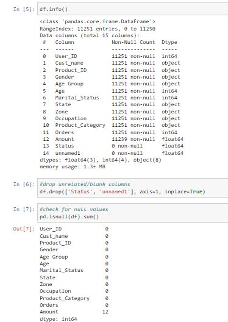
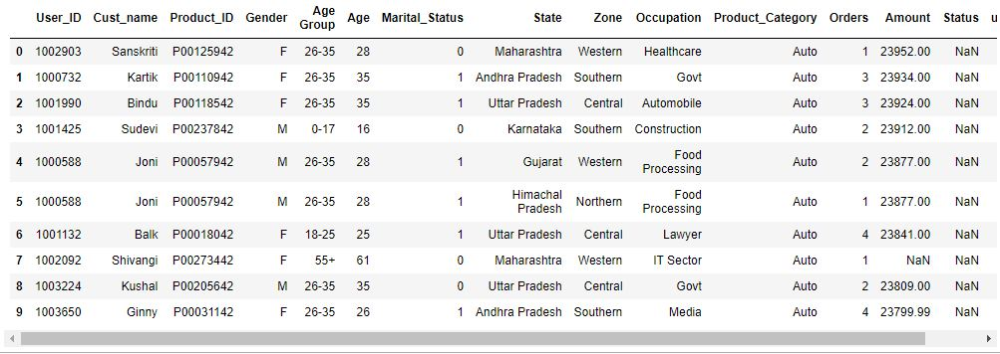
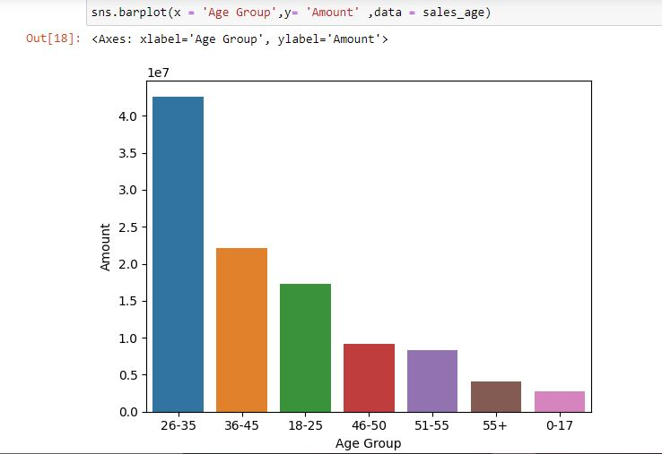
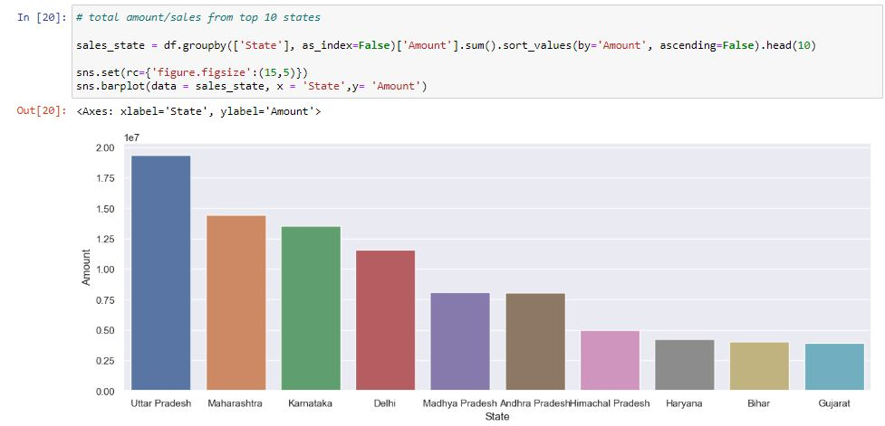
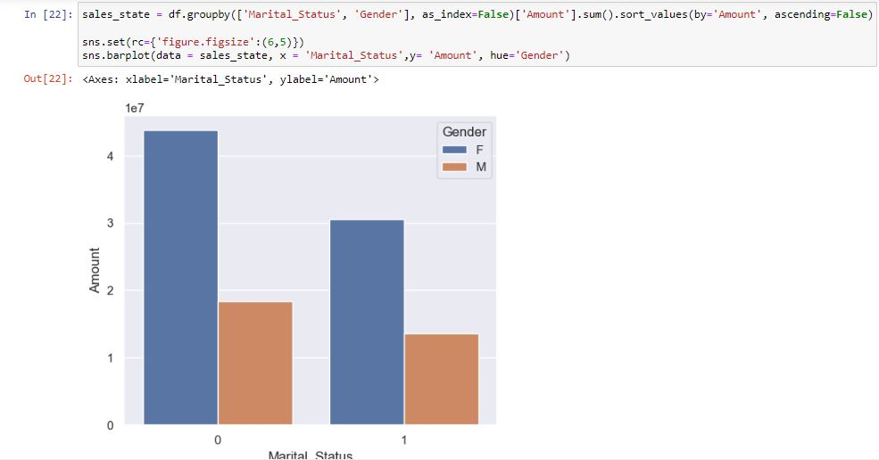
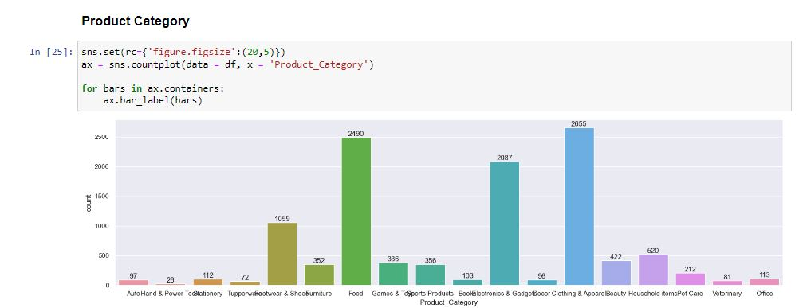
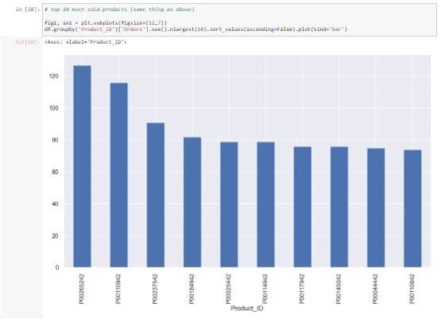

# Diwali Sales Insights 🛍️✨

  

**Welcome to Diwali Sales Insights!** 🎉📊 This repository is your gateway to uncovering the magic behind Diwali's bustling sales season. Prepare to explore, enhance customer experiences, and supercharge sales performance for an extraordinary festive celebration!

## Table of Contents

- [Introduction](#introduction)
- [Key Highlights](#key-highlights)
- [Installation](#installation)
- [Usage](#usage)
- [Data Preparation](#data-preparation)
- [Exploratory Data Analysis](#exploratory-data-analysis)
- [Elevating Customer Experiences](#elevating-customer-experiences)
- [Boosting Sales Performance](#boosting-sales-performance)
- 

## Introduction

Diwali, the festival of lights, also sheds light on numerous business opportunities. The **Diwali Sales Insights** project reveals the data-driven path to understanding consumer behavior and optimizing sales strategies during this festive season.

## Key Highlights

- 🧹 **Meticulous Data Cleanup:** Thorough data cleaning and manipulation lay the foundation for reliable analysis.
- 📊 **In-depth EDA:** Dive into pandas, matplotlib, and seaborn to unearth patterns, trends, and outliers in Diwali sales data.
- 🎯 **Customer Understanding:** Discover potential customers based on location, profession, gender, and age, for tailored marketing strategies.
- 🚀 **Optimized Sales:** Identify top-performing product categories and items to optimize inventory planning and drive sales growth.

## Installation

1. **Clone the Repository:** `git clone https://github.com/AkshayShukla16/Diwali-Sales-Analysis.git`
2. **Navigate to the Project:** `cd diwali_sales_analysis`
3. **Install Dependencies:** `pip install -r requirements.txt`

## Usage

1. **Check Python Version:** Ensure you have Python 3.6+ installed.
2. **Run the Analysis Script:** Execute `python analyze_sales.py`
3. **Explore Insights:** Uncover insights and captivating visualizations in the output.

## Data Preparation & Data Cleaning

Begin with meticulous data preparation. Rigorous cleaning and manipulation set the stage for reliable analysis.
  

  

  

  

## Exploratory Data Analysis

Unveil hidden insights using pandas, matplotlib, and seaborn. Dive into exploratory data analysis, uncovering trends, patterns, and outliers shaping Diwali sales dynamics.
  

  

  

  

  
## Elevating Customer Experiences

Go beyond numbers. Enhance customer experiences by identifying potential clients across regions, professions, genders, and ages. Fuel personalized interactions.
  

  

  

  

  

  

## Boosting Sales Performance

Ascend by identifying winning product categories and sought-after items. This insight guides inventory planning, elevating sales and customer satisfaction.
  

  

Illuminate this Diwali with the brilliance of data-driven success! 🪔📈🛍️
